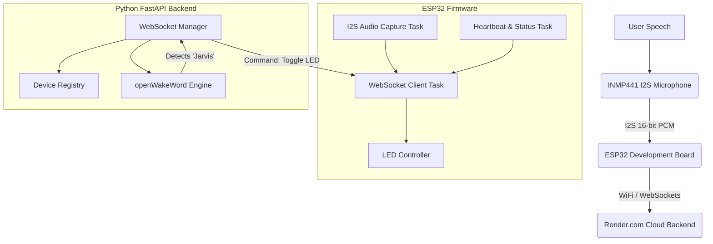

# System Architecture

## Component Diagram


## Data Flow Diagram
1. **Audio Capture:** INMP441 captures audio at 16 kHz, Mono, 16-bit PCM.
2. **Buffering & Chunking:** ESP32 buffers audio into 1024-byte chunks (approx. 32ms) to balance latency and network overhead.
3. **Streaming:** ESP32 streams raw binary chunks to the Backend via WebSockets.
4. **Inference:** Backend ingests chunks into a continuous numpy array processed by `openWakeWord`.
5. **Detection:** Upon confidence threshold > 0.5, a detection event triggers.
6. **Command:** Backend sends a JSON command `{"type": "command", "command": "led_on"}` over the WebSocket.
7. **Action:** ESP32 parses the JSON and toggles the GPIO pin connected to the LED.

## Network Architecture Diagram
```text
[ Local Wi-Fi Network ]                  [ Public Internet ]                 [ Render Cloud ]
       |                                          |                                |
  +---------+                                     |                          +-------------+
  |  ESP32  |=======(Secure WSS Connection)=======+==========================| FastAPI App |
  +---------+                                                                +-------------+
```

## INMP441 Wiring
| INMP441 Pin | ESP32 Pin | Description |
|-------------|-----------|-------------|
| VCC         | 3.3V      | Power       |
| GND         | GND       | Ground      |
| SD (Data)   | GPIO 32   | Serial Data |
| WS (LRCLK)  | GPIO 25   | Word Select |
| SCK (BCLK)  | GPIO 33   | Clock       |
| L/R         | GND       | Left Channel|

## Audio Pipeline Design
- **Sample Rate:** 16,000 Hz
- **Bit Depth:** 16-bit
- **Channels:** Mono
- **Chunk Size:** 1024 bytes (512 samples)
- **Rationale:** 512 samples at 16kHz represents 32ms of audio. This provides extremely low latency while keeping TCP packet overhead manageable. `openWakeWord` handles chunked streams seamlessly.

## Future Expansion
- **LLM Integration:** Replace the hardcoded `led_toggle` logic with an event trigger that starts a recording session, streams to an STT (like Whisper), processes via OpenAI/Gemini, and streams TTS (like Piper) back to the ESP32's I2S DAC.
- **Hardware:** Add MAX98357A I2S DAC + Speaker for TTS output.
- **Smart Home:** The Device Registry can be expanded to connect to Home Assistant via MQTT.
